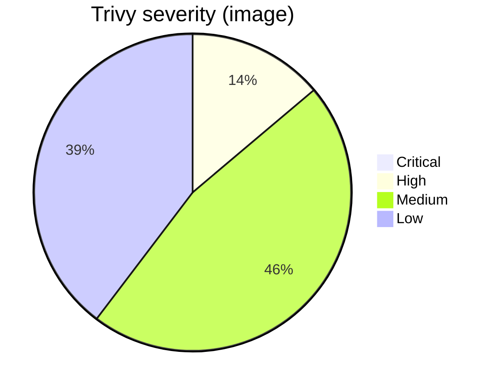
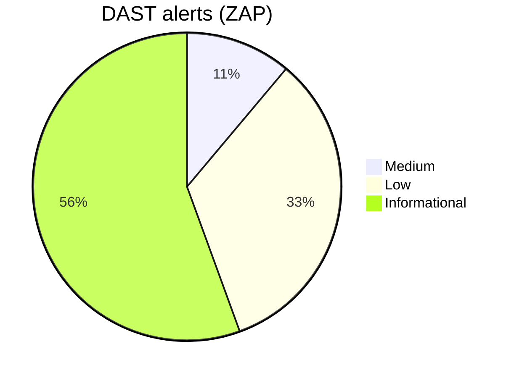
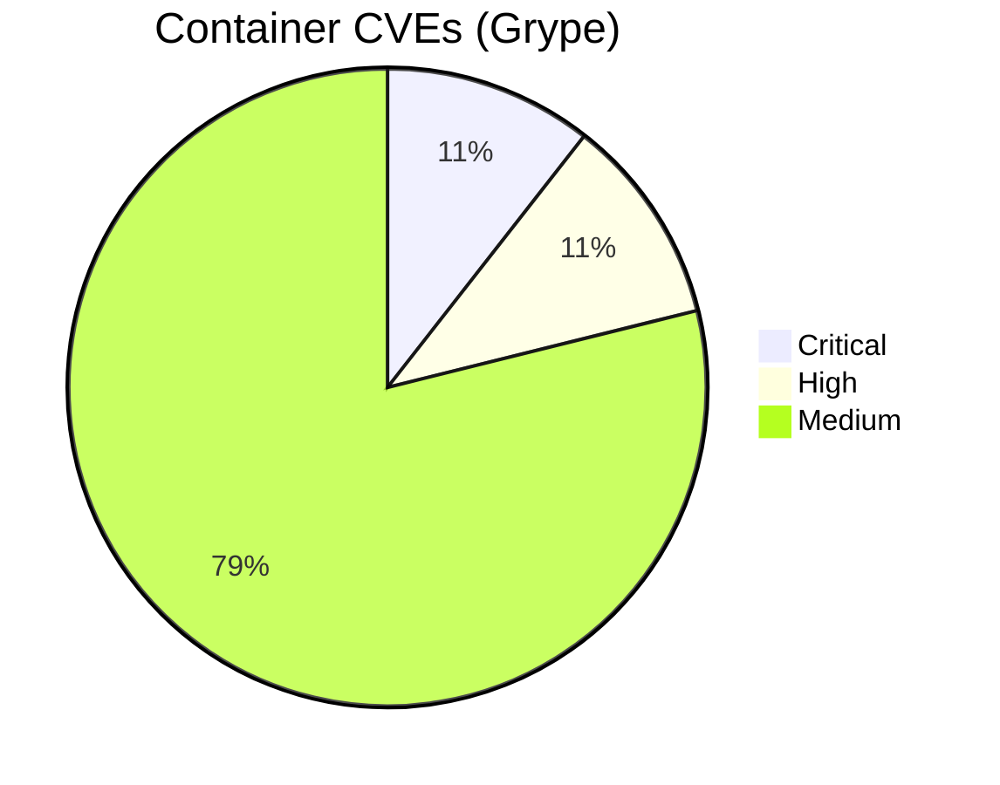

#  DevSecOps Juice Shop

This repo wraps the vulnerable OWASP Juice Shop to practice setting up an end-to-end DevSecOps lab.

<!-- security-dashboard:start -->

## 🔒 Security dashboard (Juice Shop)

### 🐳 Container image vulnerabilities (Trivy)
**Total:** 1094

| Severity (bucket) | Count |
|---|---|
| Medium | 504 |
| Low | 430 |
| High | 150 |
| Critical | 10 |

Raw severity values (from SARIF)

| Severity (raw) | Count |
|---|---|
| 5.5 | 460 |
| 2.0 | 426 |
| 8.0 | 81 |
| 7.8 | 43 |
| 4.7 | 13 |
| 6.5 | 9 |
| 7.5 | 9 |
| 5.3 | 6 |
| 7.1 | 5 |
| 9.8 | 4 |
| 4.1 | 3 |
| 7.0 | 3 |
| 7.3 | 3 |
| 8.1 | 3 |
| 9.1 | 3 |
| 9.5 | 3 |
| 3.3 | 2 |
| 4.4 | 2 |
| 4.6 | 2 |
| 5.0 | 2 |
| 6.4 | 2 |
| 6.7 | 2 |
| 0.0 | 1 |
| 1.9 | 1 |
| 4.8 | 1 |
| 6.1 | 1 |
| 6.3 | 1 |
| 7.2 | 1 |
| 7.4 | 1 |
| 7.7 | 1 |

### 🌐 DAST alerts (OWASP ZAP Baseline)
**Total:** 18

| Risk | Count |
|---|---|
| Informational | 10 |
| Low | 6 |
| Medium | 2 |

All ZAP alerts

- **Content Security Policy (CSP) Header Not Set** — _Medium_ (examples: 11) — e.g. `http://localhost:3000`
- **Cross-Domain Misconfiguration** — _Medium_ (examples: 11) — e.g. `http://localhost:3000`
- **Cross-Domain JavaScript Source File Inclusion** — _Low_ (examples: 10) — e.g. `http://localhost:3000`
- **Dangerous JS Functions** — _Low_ (examples: 2) — e.g. `http://localhost:3000/main.js`
- **Deprecated Feature Policy Header Set** — _Low_ (examples: 11) — e.g. `http://localhost:3000`
- **Full Path Disclosure** — _Low_ (examples: 6) — e.g. `http://localhost:3000/ftp/coupons_2013.md.bak`
- **Insufficient Site Isolation Against Spectre Vulnerability** — _Low_ (examples: 12) — e.g. `http://localhost:3000`
- **Timestamp Disclosure - Unix** — _Low_ (examples: 16) — e.g. `http://localhost:3000`
- **Base64 Disclosure** — _Informational_ (examples: 5) — e.g. `http://localhost:3000/ftp`
- **Information Disclosure - Suspicious Comments** — _Informational_ (examples: 2) — e.g. `http://localhost:3000/main.js`
- **Modern Web Application** — _Informational_ (examples: 11) — e.g. `http://localhost:3000`
- **Non-Storable Content** — _Informational_ (examples: 1) — e.g. `http://localhost:3000/ftp/encrypt.pyc`
- **Sec-Fetch-Dest Header is Missing** — _Informational_ (examples: 3) — e.g. `http://localhost:3000`
- **Sec-Fetch-Mode Header is Missing** — _Informational_ (examples: 3) — e.g. `http://localhost:3000`
- **Sec-Fetch-Site Header is Missing** — _Informational_ (examples: 3) — e.g. `http://localhost:3000`
- **Sec-Fetch-User Header is Missing** — _Informational_ (examples: 3) — e.g. `http://localhost:3000`
- **Storable and Cacheable Content** — _Informational_ (examples: 2) — e.g. `http://localhost:3000/ftp`
- **Storable but Non-Cacheable Content** — _Informational_ (examples: 9) — e.g. `http://localhost:3000`

### 🧰 Container CVEs (Grype from SBOM)
**Total (all severities):** 445

Show CVE table (Negligible omitted)

| Vulnerability | Package | Version | Severity | Fix | Location |
|---|---|---|---|---|---|
| `CVE-2023-2953-libldap-2.5-0` | `-` | `-` | Critical | `-` | `//usr/share/doc/libldap-2.5-0/copyright` |
| `CVE-2025-46835-git` | `-` | `-` | Critical | `-` | `//usr/share/doc/git/copyright` |
| `CVE-2025-46835-git-man` | `-` | `-` | Critical | `-` | `//usr/share/doc/git-man/copyright` |
| `CVE-2025-48384-git` | `-` | `-` | Critical | `-` | `//usr/share/doc/git/copyright` |
| `CVE-2025-48384-git-man` | `-` | `-` | Critical | `-` | `//usr/share/doc/git-man/copyright` |
| `CVE-2025-48385-git` | `-` | `-` | Critical | `-` | `//usr/share/doc/git/copyright` |
| `CVE-2025-48385-git-man` | `-` | `-` | Critical | `-` | `//usr/share/doc/git-man/copyright` |
| `CVE-2025-59375-libexpat1` | `-` | `-` | Critical | `-` | `//usr/share/doc/libexpat1/copyright` |
| `CVE-2025-6020-libpam-modules` | `-` | `-` | Critical | `-` | `//usr/share/doc/libpam-modules/copyright` |
| `CVE-2025-6020-libpam-modules-bin` | `-` | `-` | Critical | `-` | `//usr/share/doc/libpam-modules-bin/copyright` |
| `CVE-2025-6020-libpam-runtime` | `-` | `-` | Critical | `-` | `//usr/share/doc/libpam-runtime/copyright` |
| `CVE-2025-6020-libpam0g` | `-` | `-` | Critical | `-` | `//usr/share/doc/libpam0g/copyright` |
| `CVE-2025-6297-dpkg` | `-` | `-` | Critical | `-` | `//usr/share/doc/dpkg/copyright` |
| `CVE-2025-7458-libsqlite3-0` | `-` | `-` | Critical | `-` | `//usr/share/doc/libsqlite3-0/copyright` |
| `CVE-2025-8194-libpython3.11-minimal` | `-` | `-` | Critical | `-` | `//usr/share/doc/libpython3.11-minimal/copyright` |
| `CVE-2025-8194-libpython3.11-stdlib` | `-` | `-` | Critical | `-` | `//usr/share/doc/libpython3.11-minimal/copyright` |
| `CVE-2025-8194-python3.11` | `-` | `-` | Critical | `-` | `//usr/share/doc/python3.11/copyright` |
| `CVE-2025-8194-python3.11-minimal` | `-` | `-` | Critical | `-` | `//usr/share/doc/python3.11-minimal/copyright` |
| `CVE-2025-9086-libcurl3-gnutls` | `-` | `-` | Critical | `-` | `//usr/share/doc/libcurl3-gnutls/copyright` |
| `GHSA-2p57-rm9w-gvfp-ip` | `-` | `-` | Critical | `-` | `//app/node_modules/ip/package.json` |
| `GHSA-35jh-r3h4-6jhm-lodash` | `-` | `-` | Critical | `-` | `//app/node_modules/sanitize-html/node_modules/lodash/package.json` |
| `GHSA-3h5v-q93c-6h6q-ws` | `-` | `-` | Critical | `-` | `//app/frontend/node_modules/engine.io-client/node_modules/ws/package.json` |
| `GHSA-3h5v-q93c-6h6q-ws` | `-` | `-` | Critical | `-` | `//app/node_modules/engine.io/node_modules/ws/package.json` |
| `GHSA-446m-mv8f-q348-moment` | `-` | `-` | Critical | `-` | `//app/node_modules/express-jwt/node_modules/moment/package.json` |
| `GHSA-44fp-w29j-9vj5-multer` | `-` | `-` | Critical | `-` | `//app/node_modules/multer/package.json` |
| `GHSA-4pg4-qvpc-4q3h-multer` | `-` | `-` | Critical | `-` | `//app/node_modules/multer/package.json` |
| `GHSA-4xc9-xhrj-v574-lodash` | `-` | `-` | Critical | `-` | `//app/node_modules/sanitize-html/node_modules/lodash/package.json` |
| `GHSA-5mrr-rgp6-x4gr-marsdb` | `-` | `-` | Critical | `-` | `//app/node_modules/marsdb/package.json` |
| `GHSA-6g6m-m6h5-w9gf-express-jwt` | `-` | `-` | Critical | `-` | `//app/node_modules/express-jwt/package.json` |
| `GHSA-78wr-2p64-hpwj-commons-io` | `-` | `-` | Critical | `-` | `//app/frontend/node_modules/font-mfizz/blaze.jar` |
| `GHSA-8cf7-32gw-wr33-jsonwebtoken` | `-` | `-` | Critical | `-` | `//app/node_modules/express-jwt/node_modules/jsonwebtoken/package.json` |
| `GHSA-8cf7-32gw-wr33-jsonwebtoken` | `-` | `-` | Critical | `-` | `//app/node_modules/jsonwebtoken/package.json` |
| `GHSA-8hfj-j24r-96c4-moment` | `-` | `-` | Critical | `-` | `//app/node_modules/express-jwt/node_modules/moment/package.json` |
| `GHSA-c7hr-j4mj-j2w6-jsonwebtoken` | `-` | `-` | Critical | `-` | `//app/node_modules/express-jwt/node_modules/jsonwebtoken/package.json` |
| `GHSA-c7hr-j4mj-j2w6-jsonwebtoken` | `-` | `-` | Critical | `-` | `//app/node_modules/jsonwebtoken/package.json` |
| `GHSA-cchq-frgv-rjh5-vm2` | `-` | `-` | Critical | `-` | `//app/node_modules/vm2/package.json` |
| `GHSA-cgfm-xwp7-2cvr-sanitize-html` | `-` | `-` | Critical | `-` | `//app/node_modules/sanitize-html/package.json` |
| `GHSA-fjgf-rc76-4x9p-multer` | `-` | `-` | Critical | `-` | `//app/node_modules/multer/package.json` |
| `GHSA-g5hg-p3ph-g8qg-multer` | `-` | `-` | Critical | `-` | `//app/node_modules/multer/package.json` |
| `GHSA-g644-9gfx-q4q4-vm2` | `-` | `-` | Critical | `-` | `//app/node_modules/vm2/package.json` |
| `GHSA-gjcw-v447-2w7q-jws` | `-` | `-` | Critical | `-` | `//app/node_modules/jws/package.json` |
| `GHSA-grv7-fg5c-xmjg-braces` | `-` | `-` | Critical | `-` | `//app/node_modules/braces/package.json` |
| `GHSA-jf85-cpcp-j695-lodash` | `-` | `-` | Critical | `-` | `//app/node_modules/sanitize-html/node_modules/lodash/package.json` |
| `GHSA-p6mc-m468-83gw-lodash.set` | `-` | `-` | Critical | `-` | `//app/node_modules/lodash.set/package.json` |
| `GHSA-rc47-6667-2j5j-http-cache-semantics` | `-` | `-` | Critical | `-` | `//app/node_modules/http-cache-semantics/package.json` |
| `GHSA-whpj-8f3w-67p5-vm2` | `-` | `-` | Critical | `-` | `//app/node_modules/vm2/package.json` |
| `GHSA-xwcq-pm8m-c4vf-crypto-js` | `-` | `-` | Critical | `-` | `//app/node_modules/crypto-js/package.json` |
| `CVE-2023-50495-libncursesw6` | `-` | `-` | High | `-` | `//usr/share/doc/libtinfo6/copyright` |
| `CVE-2023-50495-libtinfo6` | `-` | `-` | High | `-` | `//usr/share/doc/libtinfo6/copyright` |
| `CVE-2023-50495-ncurses-base` | `-` | `-` | High | `-` | `//usr/share/doc/ncurses-base/copyright` |
| `CVE-2023-50495-ncurses-bin` | `-` | `-` | High | `-` | `//usr/share/doc/ncurses-bin/copyright` |
| `CVE-2024-10041-libpam-modules` | `-` | `-` | High | `-` | `//usr/share/doc/libpam-modules/copyright` |
| `CVE-2024-10041-libpam-modules-bin` | `-` | `-` | High | `-` | `//usr/share/doc/libpam-modules-bin/copyright` |
| `CVE-2024-10041-libpam-runtime` | `-` | `-` | High | `-` | `//usr/share/doc/libpam-runtime/copyright` |
| `CVE-2024-10041-libpam0g` | `-` | `-` | High | `-` | `//usr/share/doc/libpam0g/copyright` |
| `CVE-2024-22365-libpam-modules` | `-` | `-` | High | `-` | `//usr/share/doc/libpam-modules/copyright` |
| `CVE-2024-22365-libpam-modules-bin` | `-` | `-` | High | `-` | `//usr/share/doc/libpam-modules-bin/copyright` |
| `CVE-2024-22365-libpam-runtime` | `-` | `-` | High | `-` | `//usr/share/doc/libpam-runtime/copyright` |
| `CVE-2024-22365-libpam0g` | `-` | `-` | High | `-` | `//usr/share/doc/libpam0g/copyright` |
| `CVE-2025-10148-libcurl3-gnutls` | `-` | `-` | High | `-` | `//usr/share/doc/libcurl3-gnutls/copyright` |
| `CVE-2025-29088-libsqlite3-0` | `-` | `-` | High | `-` | `//usr/share/doc/libsqlite3-0/copyright` |
| `CVE-2025-6069-libpython3.11-minimal` | `-` | `-` | High | `-` | `//usr/share/doc/libpython3.11-minimal/copyright` |
| `CVE-2025-6069-libpython3.11-stdlib` | `-` | `-` | High | `-` | `//usr/share/doc/libpython3.11-minimal/copyright` |
| `CVE-2025-6069-python3.11` | `-` | `-` | High | `-` | `//usr/share/doc/python3.11/copyright` |
| `CVE-2025-6069-python3.11-minimal` | `-` | `-` | High | `-` | `//usr/share/doc/python3.11-minimal/copyright` |
| `CVE-2025-7709-libsqlite3-0` | `-` | `-` | High | `-` | `//usr/share/doc/libsqlite3-0/copyright` |
| `CVE-2025-9714-libxml2` | `-` | `-` | High | `-` | `//usr/share/doc/libxml2/copyright` |
| `CVE-2025-9714-libxml2-dev` | `-` | `-` | High | `-` | `//usr/share/doc/libxml2-dev/copyright` |
| `GHSA-25hc-qcg6-38wj-socket.io` | `-` | `-` | High | `-` | `//app/node_modules/socket.io/package.json` |
| `GHSA-29mw-wpgm-hmr9-lodash` | `-` | `-` | High | `-` | `//app/node_modules/sanitize-html/node_modules/lodash/package.json` |
| `GHSA-3j7m-hmh3-9jmp-sanitize-html` | `-` | `-` | High | `-` | `//app/node_modules/sanitize-html/package.json` |
| `GHSA-6fx8-h7jm-663j-parseuri` | `-` | `-` | High | `-` | `//app/frontend/node_modules/parseuri/package.json` |
| `GHSA-87vv-r9j6-g5qv-moment` | `-` | `-` | High | `-` | `//app/node_modules/express-jwt/node_modules/moment/package.json` |
| `GHSA-8g4m-cjm2-96wq-notevil` | `-` | `-` | High | `-` | `//app/node_modules/notevil/package.json` |
| `GHSA-952p-6rrq-rcjv-micromatch` | `-` | `-` | High | `-` | `//app/node_modules/micromatch/package.json` |
| `GHSA-cqmj-92xf-r6r9-socket.io-parser` | `-` | `-` | High | `-` | `//app/node_modules/socket.io-parser/package.json` |
| `GHSA-cqmj-92xf-r6r9-socket.io-parser` | `-` | `-` | High | `-` | `//app/frontend/node_modules/socket.io-client/node_modules/socket.io-parser/package.json` |
| `GHSA-f5x3-32g6-xq36-tar` | `-` | `-` | High | `-` | `//app/node_modules/node-pre-gyp/node_modules/tar/package.json` |
| `GHSA-fvqr-27wr-82fm-lodash` | `-` | `-` | High | `-` | `//app/node_modules/sanitize-html/node_modules/lodash/package.json` |
| `GHSA-gwrp-pvrq-jmwv-commons-io` | `-` | `-` | High | `-` | `//app/frontend/node_modules/font-mfizz/blaze.jar` |
| `GHSA-hjrf-2m68-5959-jsonwebtoken` | `-` | `-` | High | `-` | `//app/node_modules/express-jwt/node_modules/jsonwebtoken/package.json` |
| `GHSA-hjrf-2m68-5959-jsonwebtoken` | `-` | `-` | High | `-` | `//app/node_modules/jsonwebtoken/package.json` |
| `GHSA-mjxr-4v3x-q3m4-sanitize-html` | `-` | `-` | High | `-` | `//app/node_modules/sanitize-html/package.json` |
| `GHSA-p5gc-c584-jj6v-vm2` | `-` | `-` | High | `-` | `//app/node_modules/vm2/package.json` |
| `GHSA-pfrx-2q88-qq97-got` | `-` | `-` | High | `-` | `//app/node_modules/got/package.json` |
| `GHSA-qhxp-v273-g94h-sanitize-html` | `-` | `-` | High | `-` | `//app/node_modules/sanitize-html/package.json` |
| `GHSA-qwph-4952-7xr6-jsonwebtoken` | `-` | `-` | High | `-` | `//app/node_modules/express-jwt/node_modules/jsonwebtoken/package.json` |
| `GHSA-qwph-4952-7xr6-jsonwebtoken` | `-` | `-` | High | `-` | `//app/node_modules/jsonwebtoken/package.json` |
| `GHSA-r7qp-cfhv-p84w-engine.io` | `-` | `-` | High | `-` | `//app/node_modules/engine.io/package.json` |
| `GHSA-rjqq-98f6-6j3r-sanitize-html` | `-` | `-` | High | `-` | `//app/node_modules/sanitize-html/package.json` |
| `GHSA-rm97-x556-q36h-sanitize-html` | `-` | `-` | High | `-` | `//app/node_modules/sanitize-html/package.json` |
| `GHSA-rvg8-pwq2-xj7q-base64url` | `-` | `-` | High | `-` | `//app/node_modules/base64url/package.json` |
| `GHSA-x5rq-j2xg-h7qm-lodash` | `-` | `-` | High | `-` | `//app/node_modules/sanitize-html/node_modules/lodash/package.json` |
| `GHSA-xc6g-ggrc-qq4r-sanitize-html` | `-` | `-` | High | `-` | `//app/node_modules/sanitize-html/package.json` |
| `CVE-2005-2541-tar` | `-` | `-` | Medium | `-` | `//usr/share/doc/tar/copyright` |
| `CVE-2007-5686-login` | `-` | `-` | Medium | `-` | `//usr/share/doc/login/copyright` |
| `CVE-2007-5686-passwd` | `-` | `-` | Medium | `-` | `//usr/share/doc/passwd/copyright` |
| `CVE-2010-4756-libc-bin` | `-` | `-` | Medium | `-` | `//usr/share/doc/libc-bin/copyright` |
| `CVE-2010-4756-libc-dev-bin` | `-` | `-` | Medium | `-` | `//usr/share/doc/libc-dev-bin/copyright` |
| `CVE-2010-4756-libc6` | `-` | `-` | Medium | `-` | `//usr/share/doc/libc6/copyright` |
| `CVE-2010-4756-libc6-dev` | `-` | `-` | Medium | `-` | `//usr/share/doc/libc6-dev/copyright` |
| `CVE-2011-3374-apt` | `-` | `-` | Medium | `-` | `//usr/share/doc/apt/copyright` |
| `CVE-2011-3374-libapt-pkg6.0` | `-` | `-` | Medium | `-` | `//usr/share/doc/libapt-pkg6.0/copyright` |
| `CVE-2011-3389-libgnutls30` | `-` | `-` | Medium | `-` | `//usr/share/doc/libgnutls30/copyright` |
| `CVE-2011-4116-libperl5.36` | `-` | `-` | Medium | `-` | `//usr/share/doc/libperl5.36/copyright` |
| `CVE-2011-4116-perl` | `-` | `-` | Medium | `-` | `//usr/share/doc/perl/copyright` |
| `CVE-2011-4116-perl-base` | `-` | `-` | Medium | `-` | `//usr/share/doc/perl-base/copyright` |
| `CVE-2011-4116-perl-modules-5.36` | `-` | `-` | Medium | `-` | `//usr/share/doc/perl-modules-5.36/copyright` |
| `CVE-2013-4392-libsystemd0` | `-` | `-` | Medium | `-` | `//usr/share/doc/libsystemd0/copyright` |
| `CVE-2013-4392-libudev1` | `-` | `-` | Medium | `-` | `//usr/share/doc/libudev1/copyright` |
| `CVE-2015-3276-libldap-2.5-0` | `-` | `-` | Medium | `-` | `//usr/share/doc/libldap-2.5-0/copyright` |
| `CVE-2016-2781-coreutils` | `-` | `-` | Medium | `-` | `//usr/share/doc/coreutils/copyright` |
| `CVE-2017-13716-binutils` | `-` | `-` | Medium | `-` | `//usr/share/doc/binutils/copyright` |
| `CVE-2017-13716-binutils-common` | `-` | `-` | Medium | `-` | `//usr/share/doc/binutils-common/copyright` |
| `CVE-2017-13716-binutils-x86-64-linux-gnu` | `-` | `-` | Medium | `-` | `//usr/share/doc/binutils-common/copyright` |
| `CVE-2017-13716-libbinutils` | `-` | `-` | Medium | `-` | `//usr/share/doc/binutils-common/copyright` |
| `CVE-2017-13716-libctf-nobfd0` | `-` | `-` | Medium | `-` | `//usr/share/doc/libctf-nobfd0/copyright` |
| `CVE-2017-13716-libctf0` | `-` | `-` | Medium | `-` | `//usr/share/doc/binutils-common/copyright` |
| `CVE-2017-13716-libgprofng0` | `-` | `-` | Medium | `-` | `//usr/share/doc/binutils-common/copyright` |
| `CVE-2017-14159-libldap-2.5-0` | `-` | `-` | Medium | `-` | `//usr/share/doc/libldap-2.5-0/copyright` |
| `CVE-2017-17740-libldap-2.5-0` | `-` | `-` | Medium | `-` | `//usr/share/doc/libldap-2.5-0/copyright` |
| `CVE-2017-18018-coreutils` | `-` | `-` | Medium | `-` | `//usr/share/doc/coreutils/copyright` |
| `CVE-2018-1000021-git` | `-` | `-` | Medium | `-` | `//usr/share/doc/git/copyright` |
| `CVE-2018-1000021-git-man` | `-` | `-` | Medium | `-` | `//usr/share/doc/git-man/copyright` |
| `CVE-2018-20673-binutils` | `-` | `-` | Medium | `-` | `//usr/share/doc/binutils/copyright` |
| `CVE-2018-20673-binutils-common` | `-` | `-` | Medium | `-` | `//usr/share/doc/binutils-common/copyright` |
| `CVE-2018-20673-binutils-x86-64-linux-gnu` | `-` | `-` | Medium | `-` | `//usr/share/doc/binutils-common/copyright` |
| `CVE-2018-20673-libbinutils` | `-` | `-` | Medium | `-` | `//usr/share/doc/binutils-common/copyright` |
| `CVE-2018-20673-libctf-nobfd0` | `-` | `-` | Medium | `-` | `//usr/share/doc/libctf-nobfd0/copyright` |
| `CVE-2018-20673-libctf0` | `-` | `-` | Medium | `-` | `//usr/share/doc/binutils-common/copyright` |
| `CVE-2018-20673-libgprofng0` | `-` | `-` | Medium | `-` | `//usr/share/doc/binutils-common/copyright` |
| `CVE-2018-20712-binutils` | `-` | `-` | Medium | `-` | `//usr/share/doc/binutils/copyright` |
| `CVE-2018-20712-binutils-common` | `-` | `-` | Medium | `-` | `//usr/share/doc/binutils-common/copyright` |
| `CVE-2018-20712-binutils-x86-64-linux-gnu` | `-` | `-` | Medium | `-` | `//usr/share/doc/binutils-common/copyright` |
| `CVE-2018-20712-libbinutils` | `-` | `-` | Medium | `-` | `//usr/share/doc/binutils-common/copyright` |
| `CVE-2018-20712-libctf-nobfd0` | `-` | `-` | Medium | `-` | `//usr/share/doc/libctf-nobfd0/copyright` |
| `CVE-2018-20712-libctf0` | `-` | `-` | Medium | `-` | `//usr/share/doc/binutils-common/copyright` |
| `CVE-2018-20712-libgprofng0` | `-` | `-` | Medium | `-` | `//usr/share/doc/binutils-common/copyright` |
| `CVE-2018-20796-libc-bin` | `-` | `-` | Medium | `-` | `//usr/share/doc/libc-bin/copyright` |
| `CVE-2018-20796-libc-dev-bin` | `-` | `-` | Medium | `-` | `//usr/share/doc/libc-dev-bin/copyright` |
| `CVE-2018-20796-libc6` | `-` | `-` | Medium | `-` | `//usr/share/doc/libc6/copyright` |
| `CVE-2018-20796-libc6-dev` | `-` | `-` | Medium | `-` | `//usr/share/doc/libc6-dev/copyright` |
| `CVE-2018-5709-libgssapi-krb5-2` | `-` | `-` | Medium | `-` | `//usr/share/doc/libgssapi-krb5-2/copyright` |
| `CVE-2018-5709-libk5crypto3` | `-` | `-` | Medium | `-` | `//usr/share/doc/libk5crypto3/copyright` |
| `CVE-2018-5709-libkrb5-3` | `-` | `-` | Medium | `-` | `//usr/share/doc/libkrb5-3/copyright` |
| `CVE-2018-5709-libkrb5support0` | `-` | `-` | Medium | `-` | `//usr/share/doc/libkrb5support0/copyright` |
| `CVE-2018-6829-libgcrypt20` | `-` | `-` | Medium | `-` | `//usr/share/doc/libgcrypt20/copyright` |
| `CVE-2018-9996-binutils` | `-` | `-` | Medium | `-` | `//usr/share/doc/binutils/copyright` |
| `CVE-2018-9996-binutils-common` | `-` | `-` | Medium | `-` | `//usr/share/doc/binutils-common/copyright` |
| `CVE-2018-9996-binutils-x86-64-linux-gnu` | `-` | `-` | Medium | `-` | `//usr/share/doc/binutils-common/copyright` |
| `CVE-2018-9996-libbinutils` | `-` | `-` | Medium | `-` | `//usr/share/doc/binutils-common/copyright` |
| `CVE-2018-9996-libctf-nobfd0` | `-` | `-` | Medium | `-` | `//usr/share/doc/libctf-nobfd0/copyright` |
| `CVE-2018-9996-libctf0` | `-` | `-` | Medium | `-` | `//usr/share/doc/binutils-common/copyright` |
| `CVE-2018-9996-libgprofng0` | `-` | `-` | Medium | `-` | `//usr/share/doc/binutils-common/copyright` |
| `CVE-2019-1010022-libc-bin` | `-` | `-` | Medium | `-` | `//usr/share/doc/libc-bin/copyright` |
| `CVE-2019-1010022-libc-dev-bin` | `-` | `-` | Medium | `-` | `//usr/share/doc/libc-dev-bin/copyright` |
| `CVE-2019-1010022-libc6` | `-` | `-` | Medium | `-` | `//usr/share/doc/libc6/copyright` |
| `CVE-2019-1010022-libc6-dev` | `-` | `-` | Medium | `-` | `//usr/share/doc/libc6-dev/copyright` |
| `CVE-2019-1010023-libc-bin` | `-` | `-` | Medium | `-` | `//usr/share/doc/libc-bin/copyright` |
| `CVE-2019-1010023-libc-dev-bin` | `-` | `-` | Medium | `-` | `//usr/share/doc/libc-dev-bin/copyright` |
| `CVE-2019-1010023-libc6` | `-` | `-` | Medium | `-` | `//usr/share/doc/libc6/copyright` |
| `CVE-2019-1010023-libc6-dev` | `-` | `-` | Medium | `-` | `//usr/share/doc/libc6-dev/copyright` |
| `CVE-2019-1010024-libc-bin` | `-` | `-` | Medium | `-` | `//usr/share/doc/libc-bin/copyright` |
| `CVE-2019-1010024-libc-dev-bin` | `-` | `-` | Medium | `-` | `//usr/share/doc/libc-dev-bin/copyright` |
| `CVE-2019-1010024-libc6` | `-` | `-` | Medium | `-` | `//usr/share/doc/libc6/copyright` |
| `CVE-2019-1010024-libc6-dev` | `-` | `-` | Medium | `-` | `//usr/share/doc/libc6-dev/copyright` |
| `CVE-2019-1010025-libc-bin` | `-` | `-` | Medium | `-` | `//usr/share/doc/libc-bin/copyright` |
| `CVE-2019-1010025-libc-dev-bin` | `-` | `-` | Medium | `-` | `//usr/share/doc/libc-dev-bin/copyright` |
| `CVE-2019-1010025-libc6` | `-` | `-` | Medium | `-` | `//usr/share/doc/libc6/copyright` |
| `CVE-2019-1010025-libc6-dev` | `-` | `-` | Medium | `-` | `//usr/share/doc/libc6-dev/copyright` |
| `CVE-2019-9192-libc-bin` | `-` | `-` | Medium | `-` | `//usr/share/doc/libc-bin/copyright` |
| `CVE-2019-9192-libc-dev-bin` | `-` | `-` | Medium | `-` | `//usr/share/doc/libc-dev-bin/copyright` |
| `CVE-2019-9192-libc6` | `-` | `-` | Medium | `-` | `//usr/share/doc/libc6/copyright` |
| `CVE-2019-9192-libc6-dev` | `-` | `-` | Medium | `-` | `//usr/share/doc/libc6-dev/copyright` |
| `CVE-2020-15719-libldap-2.5-0` | `-` | `-` | Medium | `-` | `//usr/share/doc/libldap-2.5-0/copyright` |
| `CVE-2020-36325-libjansson4` | `-` | `-` | Medium | `-` | `//usr/share/doc/libjansson4/copyright` |
| `CVE-2021-32256-binutils` | `-` | `-` | Medium | `-` | `//usr/share/doc/binutils/copyright` |
| `CVE-2021-32256-binutils-common` | `-` | `-` | Medium | `-` | `//usr/share/doc/binutils-common/copyright` |
| `CVE-2021-32256-binutils-x86-64-linux-gnu` | `-` | `-` | Medium | `-` | `//usr/share/doc/binutils-common/copyright` |
| `CVE-2021-32256-libbinutils` | `-` | `-` | Medium | `-` | `//usr/share/doc/binutils-common/copyright` |
| `CVE-2021-32256-libctf-nobfd0` | `-` | `-` | Medium | `-` | `//usr/share/doc/libctf-nobfd0/copyright` |
| `CVE-2021-32256-libctf0` | `-` | `-` | Medium | `-` | `//usr/share/doc/binutils-common/copyright` |
| `CVE-2021-32256-libgprofng0` | `-` | `-` | Medium | `-` | `//usr/share/doc/binutils-common/copyright` |
| `CVE-2021-45346-libsqlite3-0` | `-` | `-` | Medium | `-` | `//usr/share/doc/libsqlite3-0/copyright` |
| `CVE-2022-0563-bsdutils` | `-` | `-` | Medium | `-` | `//usr/share/doc/bsdutils/copyright` |
| `CVE-2022-0563-libblkid1` | `-` | `-` | Medium | `-` | `//usr/share/doc/libblkid1/copyright` |
| `CVE-2022-0563-libmount1` | `-` | `-` | Medium | `-` | `//usr/share/doc/libmount1/copyright` |
| `CVE-2022-0563-libsmartcols1` | `-` | `-` | Medium | `-` | `//usr/share/doc/libsmartcols1/copyright` |
| `CVE-2022-0563-libuuid1` | `-` | `-` | Medium | `-` | `//usr/share/doc/libuuid1/copyright` |
| `CVE-2022-0563-mount` | `-` | `-` | Medium | `-` | `//usr/share/doc/mount/copyright` |
| `CVE-2022-0563-util-linux` | `-` | `-` | Medium | `-` | `//usr/share/doc/util-linux/copyright` |
| `CVE-2022-0563-util-linux-extra` | `-` | `-` | Medium | `-` | `//usr/share/doc/util-linux-extra/copyright` |
| `CVE-2022-24975-git` | `-` | `-` | Medium | `-` | `//usr/share/doc/git/copyright` |
| `CVE-2022-24975-git-man` | `-` | `-` | Medium | `-` | `//usr/share/doc/git-man/copyright` |
| `CVE-2022-27943-cpp-12` | `-` | `-` | Medium | `-` | `//usr/share/doc/gcc-12-base/copyright` |
| `CVE-2022-27943-g++-12` | `-` | `-` | Medium | `-` | `//usr/share/doc/gcc-12-base/copyright` |
| `CVE-2022-27943-gcc-12` | `-` | `-` | Medium | `-` | `//usr/share/doc/gcc-12-base/copyright` |
| `CVE-2022-27943-gcc-12-base` | `-` | `-` | Medium | `-` | `//usr/share/doc/gcc-12-base/copyright` |
| `CVE-2022-27943-libasan8` | `-` | `-` | Medium | `-` | `//usr/share/doc/gcc-12-base/copyright` |
| `CVE-2022-27943-libatomic1` | `-` | `-` | Medium | `-` | `//usr/share/doc/gcc-12-base/copyright` |
| `CVE-2022-27943-libcc1-0` | `-` | `-` | Medium | `-` | `//usr/share/doc/gcc-12-base/copyright` |
| `CVE-2022-27943-libgcc-12-dev` | `-` | `-` | Medium | `-` | `//usr/share/doc/gcc-12-base/copyright` |
| `CVE-2022-27943-libgcc-s1` | `-` | `-` | Medium | `-` | `//usr/share/doc/gcc-12-base/copyright` |
| `CVE-2022-27943-libgomp1` | `-` | `-` | Medium | `-` | `//usr/share/doc/gcc-12-base/copyright` |
| `CVE-2022-27943-libitm1` | `-` | `-` | Medium | `-` | `//usr/share/doc/gcc-12-base/copyright` |
| `CVE-2022-27943-liblsan0` | `-` | `-` | Medium | `-` | `//usr/share/doc/gcc-12-base/copyright` |
| `CVE-2022-27943-libquadmath0` | `-` | `-` | Medium | `-` | `//usr/share/doc/gcc-12-base/copyright` |
| `CVE-2022-27943-libstdc++-12-dev` | `-` | `-` | Medium | `-` | `//usr/share/doc/gcc-12-base/copyright` |
| `CVE-2022-27943-libstdc++6` | `-` | `-` | Medium | `-` | `//usr/share/doc/gcc-12-base/copyright` |
| `CVE-2022-27943-libtsan2` | `-` | `-` | Medium | `-` | `//usr/share/doc/gcc-12-base/copyright` |
| `CVE-2022-27943-libubsan1` | `-` | `-` | Medium | `-` | `//usr/share/doc/gcc-12-base/copyright` |
| `CVE-2022-3219-gpgv` | `-` | `-` | Medium | `-` | `//usr/share/doc/gpgv/copyright` |
| `CVE-2023-1972-binutils` | `-` | `-` | Medium | `-` | `//usr/share/doc/binutils/copyright` |
| `CVE-2023-1972-binutils-common` | `-` | `-` | Medium | `-` | `//usr/share/doc/binutils-common/copyright` |
| `CVE-2023-1972-binutils-x86-64-linux-gnu` | `-` | `-` | Medium | `-` | `//usr/share/doc/binutils-common/copyright` |
| `CVE-2023-1972-libbinutils` | `-` | `-` | Medium | `-` | `//usr/share/doc/binutils-common/copyright` |
| `CVE-2023-1972-libctf-nobfd0` | `-` | `-` | Medium | `-` | `//usr/share/doc/libctf-nobfd0/copyright` |
| `CVE-2023-1972-libctf0` | `-` | `-` | Medium | `-` | `//usr/share/doc/binutils-common/copyright` |
| `CVE-2023-1972-libgprofng0` | `-` | `-` | Medium | `-` | `//usr/share/doc/binutils-common/copyright` |
| `CVE-2023-31437-libsystemd0` | `-` | `-` | Medium | `-` | `//usr/share/doc/libsystemd0/copyright` |
| `CVE-2023-31437-libudev1` | `-` | `-` | Medium | `-` | `//usr/share/doc/libudev1/copyright` |
| `CVE-2023-31438-libsystemd0` | `-` | `-` | Medium | `-` | `//usr/share/doc/libsystemd0/copyright` |
| `CVE-2023-31438-libudev1` | `-` | `-` | Medium | `-` | `//usr/share/doc/libudev1/copyright` |
| `CVE-2023-31439-libsystemd0` | `-` | `-` | Medium | `-` | `//usr/share/doc/libsystemd0/copyright` |
| `CVE-2023-31439-libudev1` | `-` | `-` | Medium | `-` | `//usr/share/doc/libudev1/copyright` |
| `CVE-2023-31486-libperl5.36` | `-` | `-` | Medium | `-` | `//usr/share/doc/libperl5.36/copyright` |
| `CVE-2023-31486-perl` | `-` | `-` | Medium | `-` | `//usr/share/doc/perl/copyright` |
| `CVE-2023-31486-perl-base` | `-` | `-` | Medium | `-` | `//usr/share/doc/perl-base/copyright` |
| `CVE-2023-31486-perl-modules-5.36` | `-` | `-` | Medium | `-` | `//usr/share/doc/perl-modules-5.36/copyright` |
| `CVE-2023-52426-libexpat1` | `-` | `-` | Medium | `-` | `//usr/share/doc/libexpat1/copyright` |
| `CVE-2024-2236-libgcrypt20` | `-` | `-` | Medium | `-` | `//usr/share/doc/libgcrypt20/copyright` |
| `CVE-2024-2379-libcurl3-gnutls` | `-` | `-` | Medium | `-` | `//usr/share/doc/libcurl3-gnutls/copyright` |
| `CVE-2024-26458-libgssapi-krb5-2` | `-` | `-` | Medium | `-` | `//usr/share/doc/libgssapi-krb5-2/copyright` |
| `CVE-2024-26458-libk5crypto3` | `-` | `-` | Medium | `-` | `//usr/share/doc/libk5crypto3/copyright` |
| `CVE-2024-26458-libkrb5-3` | `-` | `-` | Medium | `-` | `//usr/share/doc/libkrb5-3/copyright` |
| `CVE-2024-26458-libkrb5support0` | `-` | `-` | Medium | `-` | `//usr/share/doc/libkrb5support0/copyright` |
| `CVE-2024-26461-libgssapi-krb5-2` | `-` | `-` | Medium | `-` | `//usr/share/doc/libgssapi-krb5-2/copyright` |
| `CVE-2024-26461-libk5crypto3` | `-` | `-` | Medium | `-` | `//usr/share/doc/libk5crypto3/copyright` |
| `CVE-2024-26461-libkrb5-3` | `-` | `-` | Medium | `-` | `//usr/share/doc/libkrb5-3/copyright` |
| `CVE-2024-26461-libkrb5support0` | `-` | `-` | Medium | `-` | `//usr/share/doc/libkrb5support0/copyright` |
| `CVE-2024-28757-libexpat1` | `-` | `-` | Medium | `-` | `//usr/share/doc/libexpat1/copyright` |
| `CVE-2024-52005-git` | `-` | `-` | Medium | `-` | `//usr/share/doc/git/copyright` |
| `CVE-2024-52005-git-man` | `-` | `-` | Medium | `-` | `//usr/share/doc/git-man/copyright` |
| `CVE-2024-53589-binutils` | `-` | `-` | Medium | `-` | `//usr/share/doc/binutils/copyright` |
| `CVE-2024-53589-binutils-common` | `-` | `-` | Medium | `-` | `//usr/share/doc/binutils-common/copyright` |
| `CVE-2024-53589-binutils-x86-64-linux-gnu` | `-` | `-` | Medium | `-` | `//usr/share/doc/binutils-common/copyright` |
| `CVE-2024-53589-libbinutils` | `-` | `-` | Medium | `-` | `//usr/share/doc/binutils-common/copyright` |
| `CVE-2024-53589-libctf-nobfd0` | `-` | `-` | Medium | `-` | `//usr/share/doc/libctf-nobfd0/copyright` |
| `CVE-2024-53589-libctf0` | `-` | `-` | Medium | `-` | `//usr/share/doc/binutils-common/copyright` |
| `CVE-2024-53589-libgprofng0` | `-` | `-` | Medium | `-` | `//usr/share/doc/binutils-common/copyright` |
| `CVE-2024-56433-login` | `-` | `-` | Medium | `-` | `//usr/share/doc/login/copyright` |
| `CVE-2024-56433-passwd` | `-` | `-` | Medium | `-` | `//usr/share/doc/passwd/copyright` |
| `CVE-2024-57360-binutils` | `-` | `-` | Medium | `-` | `//usr/share/doc/binutils/copyright` |
| `CVE-2024-57360-binutils-common` | `-` | `-` | Medium | `-` | `//usr/share/doc/binutils-common/copyright` |
| `CVE-2024-57360-binutils-x86-64-linux-gnu` | `-` | `-` | Medium | `-` | `//usr/share/doc/binutils-common/copyright` |
| `CVE-2024-57360-libbinutils` | `-` | `-` | Medium | `-` | `//usr/share/doc/binutils-common/copyright` |
| `CVE-2024-57360-libctf-nobfd0` | `-` | `-` | Medium | `-` | `//usr/share/doc/libctf-nobfd0/copyright` |
| `CVE-2024-57360-libctf0` | `-` | `-` | Medium | `-` | `//usr/share/doc/binutils-common/copyright` |
| `CVE-2024-57360-libgprofng0` | `-` | `-` | Medium | `-` | `//usr/share/doc/binutils-common/copyright` |
| `CVE-2025-0725-libcurl3-gnutls` | `-` | `-` | Medium | `-` | `//usr/share/doc/libcurl3-gnutls/copyright` |
| `CVE-2025-0840-binutils` | `-` | `-` | Medium | `-` | `//usr/share/doc/binutils/copyright` |
| `CVE-2025-0840-binutils-common` | `-` | `-` | Medium | `-` | `//usr/share/doc/binutils-common/copyright` |
| `CVE-2025-0840-binutils-x86-64-linux-gnu` | `-` | `-` | Medium | `-` | `//usr/share/doc/binutils-common/copyright` |
| `CVE-2025-0840-libbinutils` | `-` | `-` | Medium | `-` | `//usr/share/doc/binutils-common/copyright` |
| `CVE-2025-0840-libctf-nobfd0` | `-` | `-` | Medium | `-` | `//usr/share/doc/libctf-nobfd0/copyright` |
| `CVE-2025-0840-libctf0` | `-` | `-` | Medium | `-` | `//usr/share/doc/binutils-common/copyright` |
| `CVE-2025-0840-libgprofng0` | `-` | `-` | Medium | `-` | `//usr/share/doc/binutils-common/copyright` |
| `CVE-2025-11081-binutils` | `-` | `-` | Medium | `-` | `//usr/share/doc/binutils/copyright` |
| `CVE-2025-11081-binutils-common` | `-` | `-` | Medium | `-` | `//usr/share/doc/binutils-common/copyright` |
| `CVE-2025-11081-binutils-x86-64-linux-gnu` | `-` | `-` | Medium | `-` | `//usr/share/doc/binutils-common/copyright` |
| `CVE-2025-11081-libbinutils` | `-` | `-` | Medium | `-` | `//usr/share/doc/binutils-common/copyright` |
| `CVE-2025-11081-libctf-nobfd0` | `-` | `-` | Medium | `-` | `//usr/share/doc/libctf-nobfd0/copyright` |
| `CVE-2025-11081-libctf0` | `-` | `-` | Medium | `-` | `//usr/share/doc/binutils-common/copyright` |
| `CVE-2025-11081-libgprofng0` | `-` | `-` | Medium | `-` | `//usr/share/doc/binutils-common/copyright` |
| `CVE-2025-11082-binutils` | `-` | `-` | Medium | `-` | `//usr/share/doc/binutils/copyright` |
| `CVE-2025-11082-binutils-common` | `-` | `-` | Medium | `-` | `//usr/share/doc/binutils-common/copyright` |
| `CVE-2025-11082-binutils-x86-64-linux-gnu` | `-` | `-` | Medium | `-` | `//usr/share/doc/binutils-common/copyright` |
| `CVE-2025-11082-libbinutils` | `-` | `-` | Medium | `-` | `//usr/share/doc/binutils-common/copyright` |
| `CVE-2025-11082-libctf-nobfd0` | `-` | `-` | Medium | `-` | `//usr/share/doc/libctf-nobfd0/copyright` |
| `CVE-2025-11082-libctf0` | `-` | `-` | Medium | `-` | `//usr/share/doc/binutils-common/copyright` |
| `CVE-2025-11082-libgprofng0` | `-` | `-` | Medium | `-` | `//usr/share/doc/binutils-common/copyright` |
| `CVE-2025-11083-binutils` | `-` | `-` | Medium | `-` | `//usr/share/doc/binutils/copyright` |
| `CVE-2025-11083-binutils-common` | `-` | `-` | Medium | `-` | `//usr/share/doc/binutils-common/copyright` |
| `CVE-2025-11083-binutils-x86-64-linux-gnu` | `-` | `-` | Medium | `-` | `//usr/share/doc/binutils-common/copyright` |
| `CVE-2025-11083-libbinutils` | `-` | `-` | Medium | `-` | `//usr/share/doc/binutils-common/copyright` |
| `CVE-2025-11083-libctf-nobfd0` | `-` | `-` | Medium | `-` | `//usr/share/doc/libctf-nobfd0/copyright` |
| `CVE-2025-11083-libctf0` | `-` | `-` | Medium | `-` | `//usr/share/doc/binutils-common/copyright` |
| `CVE-2025-11083-libgprofng0` | `-` | `-` | Medium | `-` | `//usr/share/doc/binutils-common/copyright` |
| `CVE-2025-1147-binutils` | `-` | `-` | Medium | `-` | `//usr/share/doc/binutils/copyright` |
| `CVE-2025-1147-binutils-common` | `-` | `-` | Medium | `-` | `//usr/share/doc/binutils-common/copyright` |
| `CVE-2025-1147-binutils-x86-64-linux-gnu` | `-` | `-` | Medium | `-` | `//usr/share/doc/binutils-common/copyright` |
| `CVE-2025-1147-libbinutils` | `-` | `-` | Medium | `-` | `//usr/share/doc/binutils-common/copyright` |
| `CVE-2025-1147-libctf-nobfd0` | `-` | `-` | Medium | `-` | `//usr/share/doc/libctf-nobfd0/copyright` |
| `CVE-2025-1147-libctf0` | `-` | `-` | Medium | `-` | `//usr/share/doc/binutils-common/copyright` |
| `CVE-2025-1147-libgprofng0` | `-` | `-` | Medium | `-` | `//usr/share/doc/binutils-common/copyright` |
| `CVE-2025-1148-binutils` | `-` | `-` | Medium | `-` | `//usr/share/doc/binutils/copyright` |
| `CVE-2025-1148-binutils-common` | `-` | `-` | Medium | `-` | `//usr/share/doc/binutils-common/copyright` |
| `CVE-2025-1148-binutils-x86-64-linux-gnu` | `-` | `-` | Medium | `-` | `//usr/share/doc/binutils-common/copyright` |
| `CVE-2025-1148-libbinutils` | `-` | `-` | Medium | `-` | `//usr/share/doc/binutils-common/copyright` |
| `CVE-2025-1148-libctf-nobfd0` | `-` | `-` | Medium | `-` | `//usr/share/doc/libctf-nobfd0/copyright` |
| `CVE-2025-1148-libctf0` | `-` | `-` | Medium | `-` | `//usr/share/doc/binutils-common/copyright` |
| `CVE-2025-1148-libgprofng0` | `-` | `-` | Medium | `-` | `//usr/share/doc/binutils-common/copyright` |
| `CVE-2025-1149-binutils` | `-` | `-` | Medium | `-` | `//usr/share/doc/binutils/copyright` |
| `CVE-2025-1149-binutils-common` | `-` | `-` | Medium | `-` | `//usr/share/doc/binutils-common/copyright` |
| `CVE-2025-1149-binutils-x86-64-linux-gnu` | `-` | `-` | Medium | `-` | `//usr/share/doc/binutils-common/copyright` |
| `CVE-2025-1149-libbinutils` | `-` | `-` | Medium | `-` | `//usr/share/doc/binutils-common/copyright` |
| `CVE-2025-1149-libctf-nobfd0` | `-` | `-` | Medium | `-` | `//usr/share/doc/libctf-nobfd0/copyright` |
| `CVE-2025-1149-libctf0` | `-` | `-` | Medium | `-` | `//usr/share/doc/binutils-common/copyright` |
| `CVE-2025-1149-libgprofng0` | `-` | `-` | Medium | `-` | `//usr/share/doc/binutils-common/copyright` |
| `CVE-2025-1150-binutils` | `-` | `-` | Medium | `-` | `//usr/share/doc/binutils/copyright` |
| `CVE-2025-1150-binutils-common` | `-` | `-` | Medium | `-` | `//usr/share/doc/binutils-common/copyright` |
| `CVE-2025-1150-binutils-x86-64-linux-gnu` | `-` | `-` | Medium | `-` | `//usr/share/doc/binutils-common/copyright` |
| `CVE-2025-1150-libbinutils` | `-` | `-` | Medium | `-` | `//usr/share/doc/binutils-common/copyright` |
| `CVE-2025-1150-libctf-nobfd0` | `-` | `-` | Medium | `-` | `//usr/share/doc/libctf-nobfd0/copyright` |
| `CVE-2025-1150-libctf0` | `-` | `-` | Medium | `-` | `//usr/share/doc/binutils-common/copyright` |
| `CVE-2025-1150-libgprofng0` | `-` | `-` | Medium | `-` | `//usr/share/doc/binutils-common/copyright` |
| `CVE-2025-1151-binutils` | `-` | `-` | Medium | `-` | `//usr/share/doc/binutils/copyright` |
| `CVE-2025-1151-binutils-common` | `-` | `-` | Medium | `-` | `//usr/share/doc/binutils-common/copyright` |
| `CVE-2025-1151-binutils-x86-64-linux-gnu` | `-` | `-` | Medium | `-` | `//usr/share/doc/binutils-common/copyright` |
| `CVE-2025-1151-libbinutils` | `-` | `-` | Medium | `-` | `//usr/share/doc/binutils-common/copyright` |
| `CVE-2025-1151-libctf-nobfd0` | `-` | `-` | Medium | `-` | `//usr/share/doc/libctf-nobfd0/copyright` |
| `CVE-2025-1151-libctf0` | `-` | `-` | Medium | `-` | `//usr/share/doc/binutils-common/copyright` |
| `CVE-2025-1151-libgprofng0` | `-` | `-` | Medium | `-` | `//usr/share/doc/binutils-common/copyright` |
| `CVE-2025-1152-binutils` | `-` | `-` | Medium | `-` | `//usr/share/doc/binutils/copyright` |
| `CVE-2025-1152-binutils-common` | `-` | `-` | Medium | `-` | `//usr/share/doc/binutils-common/copyright` |
| `CVE-2025-1152-binutils-x86-64-linux-gnu` | `-` | `-` | Medium | `-` | `//usr/share/doc/binutils-common/copyright` |
| `CVE-2025-1152-libbinutils` | `-` | `-` | Medium | `-` | `//usr/share/doc/binutils-common/copyright` |
| `CVE-2025-1152-libctf-nobfd0` | `-` | `-` | Medium | `-` | `//usr/share/doc/libctf-nobfd0/copyright` |
| `CVE-2025-1152-libctf0` | `-` | `-` | Medium | `-` | `//usr/share/doc/binutils-common/copyright` |
| `CVE-2025-1152-libgprofng0` | `-` | `-` | Medium | `-` | `//usr/share/doc/binutils-common/copyright` |
| `CVE-2025-1153-binutils` | `-` | `-` | Medium | `-` | `//usr/share/doc/binutils/copyright` |
| `CVE-2025-1153-binutils-common` | `-` | `-` | Medium | `-` | `//usr/share/doc/binutils-common/copyright` |
| `CVE-2025-1153-binutils-x86-64-linux-gnu` | `-` | `-` | Medium | `-` | `//usr/share/doc/binutils-common/copyright` |
| `CVE-2025-1153-libbinutils` | `-` | `-` | Medium | `-` | `//usr/share/doc/binutils-common/copyright` |
| `CVE-2025-1153-libctf-nobfd0` | `-` | `-` | Medium | `-` | `//usr/share/doc/libctf-nobfd0/copyright` |
| `CVE-2025-1153-libctf0` | `-` | `-` | Medium | `-` | `//usr/share/doc/binutils-common/copyright` |
| `CVE-2025-1153-libgprofng0` | `-` | `-` | Medium | `-` | `//usr/share/doc/binutils-common/copyright` |
| `CVE-2025-1176-binutils` | `-` | `-` | Medium | `-` | `//usr/share/doc/binutils/copyright` |
| `CVE-2025-1176-binutils-common` | `-` | `-` | Medium | `-` | `//usr/share/doc/binutils-common/copyright` |
| `CVE-2025-1176-binutils-x86-64-linux-gnu` | `-` | `-` | Medium | `-` | `//usr/share/doc/binutils-common/copyright` |
| `CVE-2025-1176-libbinutils` | `-` | `-` | Medium | `-` | `//usr/share/doc/binutils-common/copyright` |
| `CVE-2025-1176-libctf-nobfd0` | `-` | `-` | Medium | `-` | `//usr/share/doc/libctf-nobfd0/copyright` |
| `CVE-2025-1176-libctf0` | `-` | `-` | Medium | `-` | `//usr/share/doc/binutils-common/copyright` |
| `CVE-2025-1176-libgprofng0` | `-` | `-` | Medium | `-` | `//usr/share/doc/binutils-common/copyright` |
| `CVE-2025-1178-binutils` | `-` | `-` | Medium | `-` | `//usr/share/doc/binutils/copyright` |
| `CVE-2025-1178-binutils-common` | `-` | `-` | Medium | `-` | `//usr/share/doc/binutils-common/copyright` |
| `CVE-2025-1178-binutils-x86-64-linux-gnu` | `-` | `-` | Medium | `-` | `//usr/share/doc/binutils-common/copyright` |
| `CVE-2025-1178-libbinutils` | `-` | `-` | Medium | `-` | `//usr/share/doc/binutils-common/copyright` |
| `CVE-2025-1178-libctf-nobfd0` | `-` | `-` | Medium | `-` | `//usr/share/doc/libctf-nobfd0/copyright` |
| `CVE-2025-1178-libctf0` | `-` | `-` | Medium | `-` | `//usr/share/doc/binutils-common/copyright` |
| `CVE-2025-1178-libgprofng0` | `-` | `-` | Medium | `-` | `//usr/share/doc/binutils-common/copyright` |
| `CVE-2025-1179-binutils` | `-` | `-` | Medium | `-` | `//usr/share/doc/binutils/copyright` |
| `CVE-2025-1179-binutils-common` | `-` | `-` | Medium | `-` | `//usr/share/doc/binutils-common/copyright` |
| `CVE-2025-1179-binutils-x86-64-linux-gnu` | `-` | `-` | Medium | `-` | `//usr/share/doc/binutils-common/copyright` |
| `CVE-2025-1179-libbinutils` | `-` | `-` | Medium | `-` | `//usr/share/doc/binutils-common/copyright` |
| `CVE-2025-1179-libctf-nobfd0` | `-` | `-` | Medium | `-` | `//usr/share/doc/libctf-nobfd0/copyright` |
| `CVE-2025-1179-libctf0` | `-` | `-` | Medium | `-` | `//usr/share/doc/binutils-common/copyright` |
| `CVE-2025-1179-libgprofng0` | `-` | `-` | Medium | `-` | `//usr/share/doc/binutils-common/copyright` |
| `CVE-2025-1180-binutils` | `-` | `-` | Medium | `-` | `//usr/share/doc/binutils/copyright` |
| `CVE-2025-1180-binutils-common` | `-` | `-` | Medium | `-` | `//usr/share/doc/binutils-common/copyright` |
| `CVE-2025-1180-binutils-x86-64-linux-gnu` | `-` | `-` | Medium | `-` | `//usr/share/doc/binutils-common/copyright` |
| `CVE-2025-1180-libbinutils` | `-` | `-` | Medium | `-` | `//usr/share/doc/binutils-common/copyright` |
| `CVE-2025-1180-libctf-nobfd0` | `-` | `-` | Medium | `-` | `//usr/share/doc/libctf-nobfd0/copyright` |
| `CVE-2025-1180-libctf0` | `-` | `-` | Medium | `-` | `//usr/share/doc/binutils-common/copyright` |
| `CVE-2025-1180-libgprofng0` | `-` | `-` | Medium | `-` | `//usr/share/doc/binutils-common/copyright` |
| `CVE-2025-1181-binutils` | `-` | `-` | Medium | `-` | `//usr/share/doc/binutils/copyright` |
| `CVE-2025-1181-binutils-common` | `-` | `-` | Medium | `-` | `//usr/share/doc/binutils-common/copyright` |
| `CVE-2025-1181-binutils-x86-64-linux-gnu` | `-` | `-` | Medium | `-` | `//usr/share/doc/binutils-common/copyright` |
| `CVE-2025-1181-libbinutils` | `-` | `-` | Medium | `-` | `//usr/share/doc/binutils-common/copyright` |
| `CVE-2025-1181-libctf-nobfd0` | `-` | `-` | Medium | `-` | `//usr/share/doc/libctf-nobfd0/copyright` |
| `CVE-2025-1181-libctf0` | `-` | `-` | Medium | `-` | `//usr/share/doc/binutils-common/copyright` |
| `CVE-2025-1181-libgprofng0` | `-` | `-` | Medium | `-` | `//usr/share/doc/binutils-common/copyright` |
| `CVE-2025-1182-binutils` | `-` | `-` | Medium | `-` | `//usr/share/doc/binutils/copyright` |
| `CVE-2025-1182-binutils-common` | `-` | `-` | Medium | `-` | `//usr/share/doc/binutils-common/copyright` |
| `CVE-2025-1182-binutils-x86-64-linux-gnu` | `-` | `-` | Medium | `-` | `//usr/share/doc/binutils-common/copyright` |
| `CVE-2025-1182-libbinutils` | `-` | `-` | Medium | `-` | `//usr/share/doc/binutils-common/copyright` |
| `CVE-2025-1182-libctf-nobfd0` | `-` | `-` | Medium | `-` | `//usr/share/doc/libctf-nobfd0/copyright` |
| `CVE-2025-1182-libctf0` | `-` | `-` | Medium | `-` | `//usr/share/doc/binutils-common/copyright` |
| `CVE-2025-1182-libgprofng0` | `-` | `-` | Medium | `-` | `//usr/share/doc/binutils-common/copyright` |
| `CVE-2025-27587-libssl3` | `-` | `-` | Medium | `-` | `//usr/share/doc/libssl3/copyright` |
| `CVE-2025-27587-openssl` | `-` | `-` | Medium | `-` | `//usr/share/doc/openssl/copyright` |
| `CVE-2025-27613-git` | `-` | `-` | Medium | `-` | `//usr/share/doc/git/copyright` |
| `CVE-2025-27613-git-man` | `-` | `-` | Medium | `-` | `//usr/share/doc/git-man/copyright` |
| `CVE-2025-30258-gpgv` | `-` | `-` | Medium | `-` | `//usr/share/doc/gpgv/copyright` |
| `CVE-2025-3198-binutils` | `-` | `-` | Medium | `-` | `//usr/share/doc/binutils/copyright` |
| `CVE-2025-3198-binutils-common` | `-` | `-` | Medium | `-` | `//usr/share/doc/binutils-common/copyright` |
| `CVE-2025-3198-binutils-x86-64-linux-gnu` | `-` | `-` | Medium | `-` | `//usr/share/doc/binutils-common/copyright` |
| `CVE-2025-3198-libbinutils` | `-` | `-` | Medium | `-` | `//usr/share/doc/binutils-common/copyright` |
| `CVE-2025-3198-libctf-nobfd0` | `-` | `-` | Medium | `-` | `//usr/share/doc/libctf-nobfd0/copyright` |
| `CVE-2025-3198-libctf0` | `-` | `-` | Medium | `-` | `//usr/share/doc/binutils-common/copyright` |
| `CVE-2025-3198-libgprofng0` | `-` | `-` | Medium | `-` | `//usr/share/doc/binutils-common/copyright` |
| `CVE-2025-4516-libpython3.11-minimal` | `-` | `-` | Medium | `-` | `//usr/share/doc/libpython3.11-minimal/copyright` |
| `CVE-2025-4516-libpython3.11-stdlib` | `-` | `-` | Medium | `-` | `//usr/share/doc/libpython3.11-minimal/copyright` |
| `CVE-2025-4516-python3.11` | `-` | `-` | Medium | `-` | `//usr/share/doc/python3.11/copyright` |
| `CVE-2025-4516-python3.11-minimal` | `-` | `-` | Medium | `-` | `//usr/share/doc/python3.11-minimal/copyright` |
| `CVE-2025-5244-binutils` | `-` | `-` | Medium | `-` | `//usr/share/doc/binutils/copyright` |
| `CVE-2025-5244-binutils-common` | `-` | `-` | Medium | `-` | `//usr/share/doc/binutils-common/copyright` |
| `CVE-2025-5244-binutils-x86-64-linux-gnu` | `-` | `-` | Medium | `-` | `//usr/share/doc/binutils-common/copyright` |
| `CVE-2025-5244-libbinutils` | `-` | `-` | Medium | `-` | `//usr/share/doc/binutils-common/copyright` |
| `CVE-2025-5244-libctf-nobfd0` | `-` | `-` | Medium | `-` | `//usr/share/doc/libctf-nobfd0/copyright` |
| `CVE-2025-5244-libctf0` | `-` | `-` | Medium | `-` | `//usr/share/doc/binutils-common/copyright` |
| `CVE-2025-5244-libgprofng0` | `-` | `-` | Medium | `-` | `//usr/share/doc/binutils-common/copyright` |
| `CVE-2025-5245-binutils` | `-` | `-` | Medium | `-` | `//usr/share/doc/binutils/copyright` |
| `CVE-2025-5245-binutils-common` | `-` | `-` | Medium | `-` | `//usr/share/doc/binutils-common/copyright` |
| `CVE-2025-5245-binutils-x86-64-linux-gnu` | `-` | `-` | Medium | `-` | `//usr/share/doc/binutils-common/copyright` |
| `CVE-2025-5245-libbinutils` | `-` | `-` | Medium | `-` | `//usr/share/doc/binutils-common/copyright` |
| `CVE-2025-5245-libctf-nobfd0` | `-` | `-` | Medium | `-` | `//usr/share/doc/libctf-nobfd0/copyright` |
| `CVE-2025-5245-libctf0` | `-` | `-` | Medium | `-` | `//usr/share/doc/binutils-common/copyright` |
| `CVE-2025-5245-libgprofng0` | `-` | `-` | Medium | `-` | `//usr/share/doc/binutils-common/copyright` |
| `CVE-2025-5278-coreutils` | `-` | `-` | Medium | `-` | `//usr/share/doc/coreutils/copyright` |
| `CVE-2025-6141-libncursesw6` | `-` | `-` | Medium | `-` | `//usr/share/doc/libtinfo6/copyright` |
| `CVE-2025-6141-libtinfo6` | `-` | `-` | Medium | `-` | `//usr/share/doc/libtinfo6/copyright` |
| `CVE-2025-6141-ncurses-base` | `-` | `-` | Medium | `-` | `//usr/share/doc/ncurses-base/copyright` |
| `CVE-2025-6141-ncurses-bin` | `-` | `-` | Medium | `-` | `//usr/share/doc/ncurses-bin/copyright` |
| `CVE-2025-7545-binutils` | `-` | `-` | Medium | `-` | `//usr/share/doc/binutils/copyright` |
| `CVE-2025-7545-binutils-common` | `-` | `-` | Medium | `-` | `//usr/share/doc/binutils-common/copyright` |
| `CVE-2025-7545-binutils-x86-64-linux-gnu` | `-` | `-` | Medium | `-` | `//usr/share/doc/binutils-common/copyright` |
| `CVE-2025-7545-libbinutils` | `-` | `-` | Medium | `-` | `//usr/share/doc/binutils-common/copyright` |
| `CVE-2025-7545-libctf-nobfd0` | `-` | `-` | Medium | `-` | `//usr/share/doc/libctf-nobfd0/copyright` |
| `CVE-2025-7545-libctf0` | `-` | `-` | Medium | `-` | `//usr/share/doc/binutils-common/copyright` |
| `CVE-2025-7545-libgprofng0` | `-` | `-` | Medium | `-` | `//usr/share/doc/binutils-common/copyright` |
| `CVE-2025-7546-binutils` | `-` | `-` | Medium | `-` | `//usr/share/doc/binutils/copyright` |
| `CVE-2025-7546-binutils-common` | `-` | `-` | Medium | `-` | `//usr/share/doc/binutils-common/copyright` |
| `CVE-2025-7546-binutils-x86-64-linux-gnu` | `-` | `-` | Medium | `-` | `//usr/share/doc/binutils-common/copyright` |
| `CVE-2025-7546-libbinutils` | `-` | `-` | Medium | `-` | `//usr/share/doc/binutils-common/copyright` |
| `CVE-2025-7546-libctf-nobfd0` | `-` | `-` | Medium | `-` | `//usr/share/doc/libctf-nobfd0/copyright` |
| `CVE-2025-7546-libctf0` | `-` | `-` | Medium | `-` | `//usr/share/doc/binutils-common/copyright` |
| `CVE-2025-7546-libgprofng0` | `-` | `-` | Medium | `-` | `//usr/share/doc/binutils-common/copyright` |
| `CVE-2025-8224-binutils` | `-` | `-` | Medium | `-` | `//usr/share/doc/binutils/copyright` |
| `CVE-2025-8224-binutils-common` | `-` | `-` | Medium | `-` | `//usr/share/doc/binutils-common/copyright` |
| `CVE-2025-8224-binutils-x86-64-linux-gnu` | `-` | `-` | Medium | `-` | `//usr/share/doc/binutils-common/copyright` |
| `CVE-2025-8224-libbinutils` | `-` | `-` | Medium | `-` | `//usr/share/doc/binutils-common/copyright` |
| `CVE-2025-8224-libctf-nobfd0` | `-` | `-` | Medium | `-` | `//usr/share/doc/libctf-nobfd0/copyright` |
| `CVE-2025-8224-libctf0` | `-` | `-` | Medium | `-` | `//usr/share/doc/binutils-common/copyright` |
| `CVE-2025-8224-libgprofng0` | `-` | `-` | Medium | `-` | `//usr/share/doc/binutils-common/copyright` |
| `CVE-2025-8225-binutils` | `-` | `-` | Medium | `-` | `//usr/share/doc/binutils/copyright` |
| `CVE-2025-8225-binutils-common` | `-` | `-` | Medium | `-` | `//usr/share/doc/binutils-common/copyright` |
| `CVE-2025-8225-binutils-x86-64-linux-gnu` | `-` | `-` | Medium | `-` | `//usr/share/doc/binutils-common/copyright` |
| `CVE-2025-8225-libbinutils` | `-` | `-` | Medium | `-` | `//usr/share/doc/binutils-common/copyright` |
| `CVE-2025-8225-libctf-nobfd0` | `-` | `-` | Medium | `-` | `//usr/share/doc/libctf-nobfd0/copyright` |
| `CVE-2025-8225-libctf0` | `-` | `-` | Medium | `-` | `//usr/share/doc/binutils-common/copyright` |
| `CVE-2025-8225-libgprofng0` | `-` | `-` | Medium | `-` | `//usr/share/doc/binutils-common/copyright` |
| `CVE-2025-8732-libxml2` | `-` | `-` | Medium | `-` | `//usr/share/doc/libxml2/copyright` |
| `CVE-2025-8732-libxml2-dev` | `-` | `-` | Medium | `-` | `//usr/share/doc/libxml2-dev/copyright` |
| `GHSA-pxg6-pf52-xh8x-cookie` | `-` | `-` | Medium | `-` | `//app/node_modules/engine.io/node_modules/cookie/package.json` |

### 📦 SBOM (Syft)
**Components indexed:** 13764

_Note: SBOM components are not vulnerabilities, but help quantify the attack surface._

### 📎 Artifacts
- Trivy SARIF: `trivy-image.sarif`
- ZAP JSON: `report_json.json`
- SBOM (CycloneDX): `sbom.cdx.json`
- Grype SARIF: `grype.sarif`
- Grype Table: `grype.txt`

<!-- security-dashboard:end -->

## GitHub Actions

### Juice-Shop Scanning

- Dependency vulnerability: npm audit
- Container image scanning: Trivy/Grype (on the Juice Shop image).
- DAST: OWASP ZAP baseline scan against running Juice Shop.
- SBOM: Syft (CycloneDX/SPDX) + attach as artifact.

### Pipeline Scanning

- Secrets scanning: Gitleaks (pre-commit + CI).
- SAST: Semgrep (JS/TS rules, OWASP Top 10).
- Dependency vulnerability: npm audit + Trivy (filesystem scan) or Snyk (optional).
- Dockerfile linting: Hadolint.
- IaC scanning: Checkov (Terraform), kube-linter or kube-score for K8s.
- Signature/provenance: Cosign (keyless OIDC) + SLSA provenance (optional).
- SARIF reporting to GitHub’s “Security > Code scanning alerts”.

