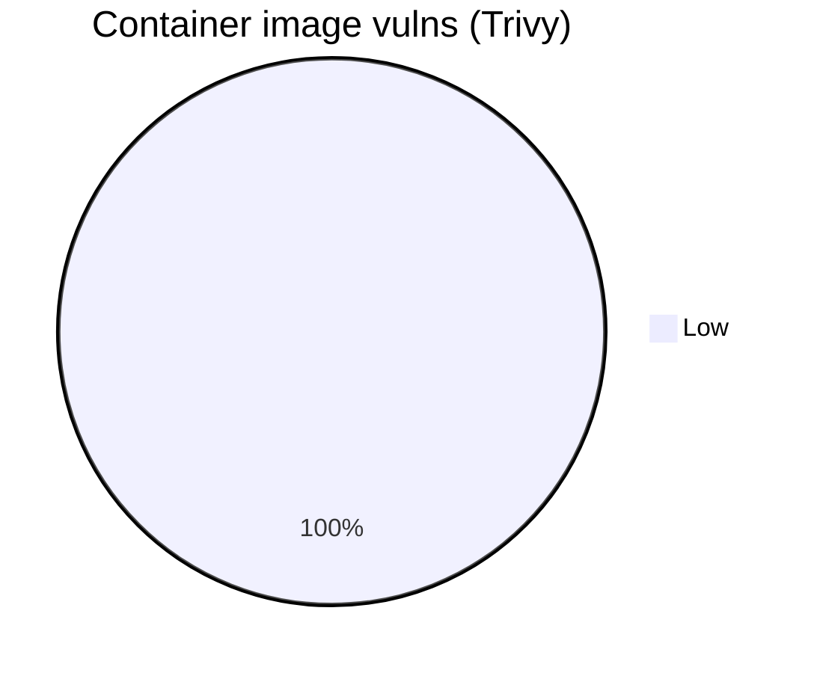

## 🔒 Security dashboard (Juice Shop)

### 🐳 Container image vulnerabilities (Trivy)
**Total:** 1094

| Severity | Count |
|---|---|
| 5.5 | 460 |
| 2.0 | 426 |
| 8.0 | 81 |
| 7.8 | 43 |
| 4.7 | 13 |
| 6.5 | 9 |
| 7.5 | 9 |
| 5.3 | 6 |
| 7.1 | 5 |
| 9.8 | 4 |
| 4.1 | 3 |
| 7.0 | 3 |
| 7.3 | 3 |
| 8.1 | 3 |
| 9.1 | 3 |
| 9.5 | 3 |
| 3.3 | 2 |
| 4.4 | 2 |
| 4.6 | 2 |
| 5.0 | 2 |
| 6.4 | 2 |
| 6.7 | 2 |
| 0.0 | 1 |
| 1.9 | 1 |
| 4.8 | 1 |
| 6.1 | 1 |
| 6.3 | 1 |
| 7.2 | 1 |
| 7.4 | 1 |
| 7.7 | 1 |

### 🌐 DAST alerts (OWASP ZAP Baseline)
**Total:** 18

| Risk | Count |
|---|---|
| Informational | 10 |
| Low | 6 |
| Medium | 2 |

All ZAP alerts

- **Content Security Policy (CSP) Header Not Set** — _Medium_ (examples: 11) — e.g. `http://localhost:3000`
- **Cross-Domain Misconfiguration** — _Medium_ (examples: 11) — e.g. `http://localhost:3000`
- **Cross-Domain JavaScript Source File Inclusion** — _Low_ (examples: 10) — e.g. `http://localhost:3000`
- **Dangerous JS Functions** — _Low_ (examples: 2) — e.g. `http://localhost:3000/main.js`
- **Deprecated Feature Policy Header Set** — _Low_ (examples: 12) — e.g. `http://localhost:3000`
- **Full Path Disclosure** — _Low_ (examples: 6) — e.g. `http://localhost:3000/ftp/coupons_2013.md.bak`
- **Insufficient Site Isolation Against Spectre Vulnerability** — _Low_ (examples: 10) — e.g. `http://localhost:3000`
- **Timestamp Disclosure - Unix** — _Low_ (examples: 16) — e.g. `http://localhost:3000`
- **Base64 Disclosure** — _Informational_ (examples: 5) — e.g. `http://localhost:3000/ftp`
- **Information Disclosure - Suspicious Comments** — _Informational_ (examples: 2) — e.g. `http://localhost:3000/main.js`
- **Modern Web Application** — _Informational_ (examples: 11) — e.g. `http://localhost:3000`
- **Non-Storable Content** — _Informational_ (examples: 1) — e.g. `http://localhost:3000/ftp/eastere.gg`
- **Sec-Fetch-Dest Header is Missing** — _Informational_ (examples: 3) — e.g. `http://localhost:3000`
- **Sec-Fetch-Mode Header is Missing** — _Informational_ (examples: 3) — e.g. `http://localhost:3000`
- **Sec-Fetch-Site Header is Missing** — _Informational_ (examples: 2) — e.g. `http://localhost:3000`
- **Sec-Fetch-User Header is Missing** — _Informational_ (examples: 3) — e.g. `http://localhost:3000`
- **Storable and Cacheable Content** — _Informational_ (examples: 2) — e.g. `http://localhost:3000/ftp`
- **Storable but Non-Cacheable Content** — _Informational_ (examples: 8) — e.g. `http://localhost:3000`

### 🧰 Container CVEs (Grype from SBOM)
**Total (all severities):** 0

Show CVE table (Negligible omitted)

_No vulnerabilities reported by Grype._

### 📦 SBOM (Syft)
**Components indexed:** 13776

_Note: SBOM components are not vulnerabilities, but help quantify the attack surface._

### 📎 Artifacts
- Trivy SARIF: `trivy-image.sarif`
- ZAP JSON: `report_json.json`
- SBOM (CycloneDX): `sbom.cdx.json`
